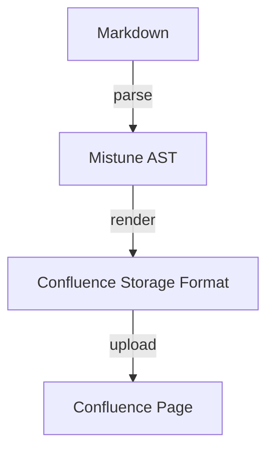
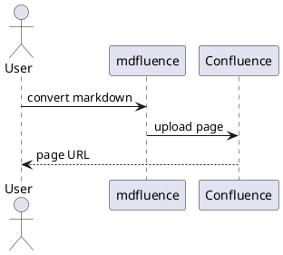

# Plugin Feature Showcase

## Tables

| Plugin | Syntax | Output |
|--------|--------|--------|
| strikethrough | `~~text~~` | ~~removed~~ |
| mark | `==text==` | ==highlighted== |
| superscript | `x^2^` | x^2^ |

## Definition Lists

Confluence
:   A team workspace where knowledge and collaboration meet.

Markdown
:   A lightweight markup language for creating formatted text.

## Footnotes

Mistune supports footnotes[^1] and multiple references[^2].

[^1]: This is the first footnote.
[^2]: This is the second footnote with more detail.

## Formatting

- Bold: **this text is bold**, (__alternative bold text__)
- Italics: *this text is in italics*, (_alternative italics text_)
- Strikethrough: ~~this text is deleted~~
- Highlight: ==this text is marked==
- Insert: ^^this text was inserted^^
- Superscript: E = mc^2^
- Subscript: H~2~O is water, CO~2~ is carbon dioxide

## Math

Inline math:

Inline math w/o surrouding spaces: $E = mc^2$

Inline math w/ surrounding spaces: $ a^2 + b^2 = c^2 $

Block math:
$$
\sum_{i=1}^{n} x_i = x_1 + x_2 + \cdots + x_n
$$

The next 2 lines should NOT be rendered as math:

Prices: Product A is $5,600.00 and Product B is $7,600.00.

Single-Line Formula over serveral lines: $ a^2 + b^2 =
c^2 $

## Spoiler

>! This is a spoiler block that should be hidden by default.

## Task Lists

- [x] Enable table plugin
- [x] Enable strikethrough plugin
- [x] Enable all remaining plugins
- [ ] Ship the release

## Auto-linked URLs

Visit https://github.com for code hosting.
Documentation at https://mistune.lepture.com/en/latest/plugins.html is helpful.

## Abbreviations

The HTML specification is maintained by the W3C.
You can write CSS alongside your HTML documents.

*[HTML]: Hyper Text Markup Language (Should not be rendered)
*[W3C]: World Wide Web Consortium (same as above)
*[CSS]: Cascading Style Sheets (same as above)

## Standard Markdown (no plugin needed)

**Bold**, *italic*, `inline code`, and [links](https://example.com).

> A blockquote for good measure.

```python
def hello():
    print("Hello from mdfluence!")
```

## GFM Alerts

> [!NOTE]
> This is a note alert for helpful information.

> [!TIP]
> This is a tip alert for best practices.

> [!WARNING]
> This is a warning alert for potential issues.

> [!CAUTION]
> This is a caution alert for dangerous actions.

> [!IMPORTANT]
> This is an important alert for critical details.

## Emoji Shortcodes

Reactions: :smile: :thumbsup: :heart: :rocket: :eyes:

Status: :white_check_mark: :x: :warning: :construction:

Fun: :tada: :sparkles: :fire: :bug: :gem:

Unknown shortcode passthrough: :not_a_real_emoji:

## Diagram Rendering





## Heading Anchors

Jump to [Tables](#tables), [Math](#math), or [Task Lists](#task-lists).

A link to [Emoji Shortcodes](#emoji-shortcodes) and [GFM Alerts](#gfm-alerts).

---

## Inline HTML / XHTML Compatibility

Void elements like `<br>` and `<hr>` must self-close in Confluence XHTML:

First line<br>Second line<br>Third line

<hr>

Table with inline breaks:

| Item | Notes |
|------|-------|
| Alpha | Note A<br>Note B |
| Beta | Note C<br>Note D |

---

That's all the plugins!
